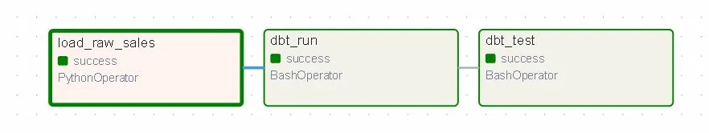
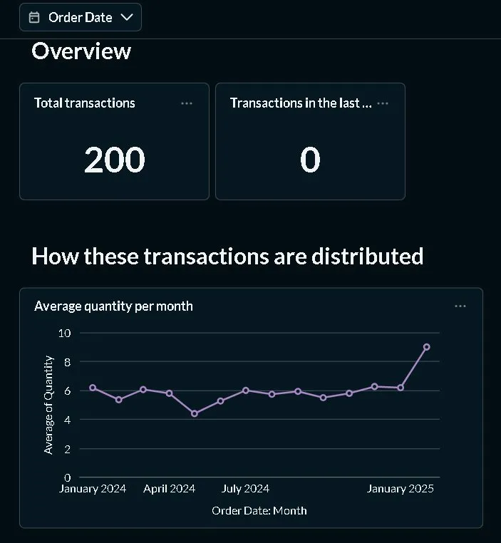

# Retail Data Warehouse

An end-to-end ELT data warehouse pipeline built with PostgreSQL, dbt, Apache Airflow, and Metabase. The pipeline ingests raw retail sales data, loads it into PostgreSQL, transforms it using dbt transformation models and data quality tests, and visualizes business KPIs through a BI dashboard.

---

## Business Problem

Retail sales data is often stored in raw formats that are not suitable for analysis. This project builds a data warehouse to transform raw transactional data into structured analytical models, enabling analysis of sales trends, product performance, and business KPIs.

---

## Key Highlights

- Automated daily pipeline with Apache Airflow (3-task DAG: ingest → transform → test)
- 7/7 dbt data quality tests passing (not_null constraints)
- 3 dbt transformation models and data quality tests: staging, fact, and dimension layers
- Business KPIs visualized across 3 Metabase dashboards
- Fully containerized with Docker

---

## Key Insights

- Identified monthly sales trends and seasonality patterns across Jan 2011 – Dec 2011
- Analyzed product-level performance using fact and dimension models
- Tracked transaction distribution and average quantity trends over time

---

## Architecture

```
Raw CSV Data
     |
     v
Apache Airflow (Orchestration)
  |
  |-- PostgreSQL (Staging Layer)
  |        |
  |        v
  |-- dbt Models (Transformation Layer)
           |-- stg_sales    : clean and rename raw data
           |-- fct_sales    : sales fact table
           |-- dim_products : product dimension table
     |
     v
Metabase (BI Dashboard)
```

---

## Tech Stack

| Tool           | Version   | Purpose                    |
|----------------|-----------|----------------------------|
| PostgreSQL     | 15        | Data storage and staging   |
| dbt-core       | 1.8.7     | Data transformation        |
| dbt-postgres   | 1.8.2     | dbt PostgreSQL adapter     |
| Apache Airflow | 2.9.3     | Pipeline orchestration     |
| Metabase       | v0.59.2.5 | BI dashboards              |
| Docker         | 29.2.1    | Container runtime          |

---

## Project Structure

```
Retail-Data-Warehouse/
├── dags/
│   └── retail_pipeline.py
├── retail_dw/
│   ├── models/
│   │   ├── stg_sales.sql
│   │   ├── fct_sales.sql
│   │   └── dim_products.sql
│   └── schema.yml
├── data/
│   └── raw_sales.csv
├── screenshots/
│   ├── airflow_dag.png
│   └── metabase_dashboard.png
├── docker-compose.yml
└── README.md
```

---

## Getting Started

### Prerequisites

- Docker Desktop
- Python 3.12
- WSL2 with Ubuntu 24.04 (Windows users)

### 1. Start Infrastructure

```bash
docker-compose up -d
```

### 2. Set Up Python Environment

```bash
python3 -m venv airflow_venv
source airflow_venv/bin/activate
pip install "apache-airflow==2.9.3" --constraint "https://raw.githubusercontent.com/apache/airflow/constraints-2.9.3/constraints-3.12.txt"
pip install apache-airflow-providers-postgres psycopg2-binary "dbt-postgres==1.8.2" --constraint "https://raw.githubusercontent.com/apache/airflow/constraints-2.9.3/constraints-3.12.txt"
```

### 3. Initialize Airflow

```bash
export AIRFLOW_HOME=~/airflow
airflow db init
airflow webserver --port 8080 -D
airflow scheduler -D
```

### 4. Verify dbt Connection

```bash
cd retail_dw
dbt debug
```

---

## Pipeline Execution

The pipeline is triggered via Airflow DAG:

1. **Ingest** — load raw sales data into PostgreSQL (`load_raw_sales`)
2. **Transform** — run dbt models for staging, fact, and dimension layers (`dbt_run`)
3. **Validate** — execute dbt data quality tests (`dbt_test`)

---

## Data Models

### Staging
- **stg_sales** — cleaned and renamed raw sales records

### Marts
- **fct_sales** — fact table with sales metrics
- **dim_products** — product dimension table

---

## Metabase Dashboards

Three dashboards built on top of the warehouse models:

| Dashboard  | Metrics                                           |
|------------|---------------------------------------------------|
| Raw Sales  | Total transaction count (49,005 records)             |
| Stg Sales  | Average quantity per month, sales trend over time |
| Fct Sales  | Transaction distribution, monthly quantity trends |

---

## Screenshots

### Airflow DAG — All Tasks Successful



### Metabase Dashboard — Sales KPIs



---

## Author

**Guna Sekhar Adapaka**

- GitHub: [AdapakaGunaSekhar004](https://github.com/AdapakaGunaSekhar004)
- LinkedIn: [guna-sekhar-adapaka](https://www.linkedin.com/in/guna-sekhar-adapaka-6903ab23b/)
- Portfolio: [adapakagunasekhar004.github.io](https://adapakagunasekhar004.github.io/portfolioper/)